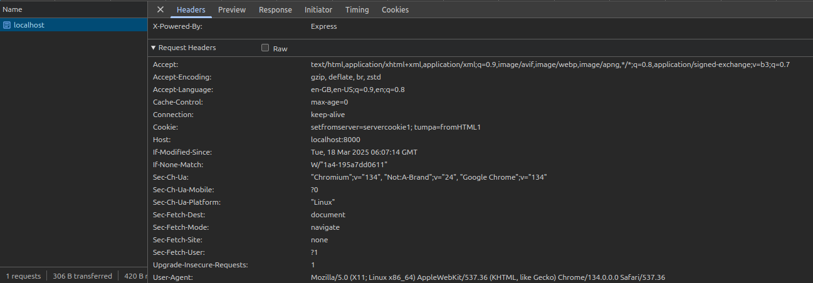
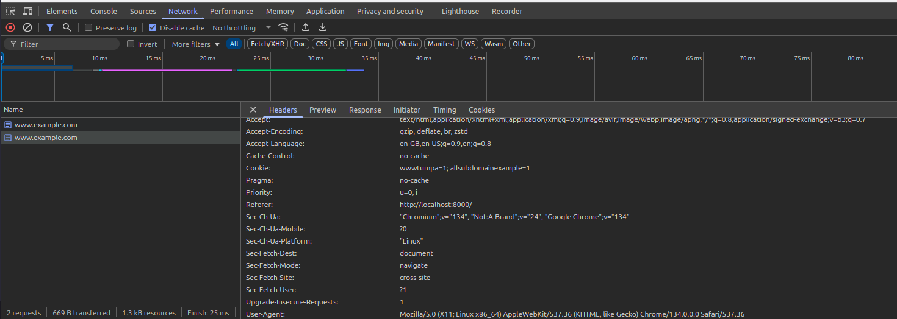
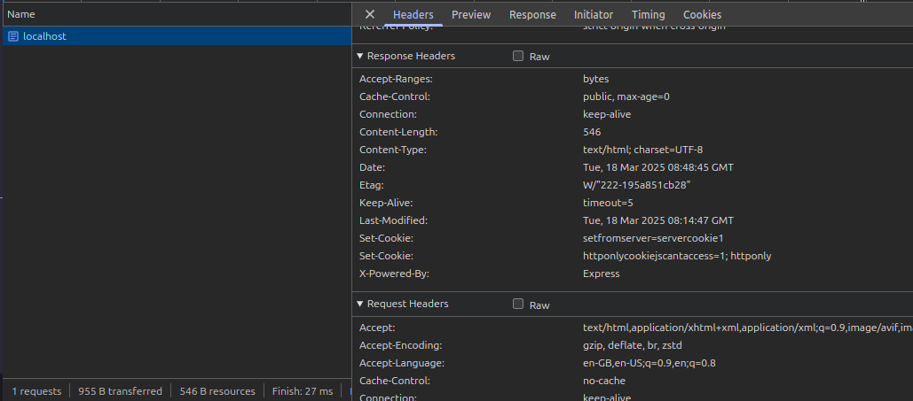
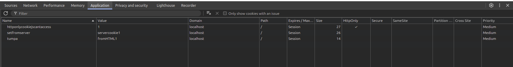
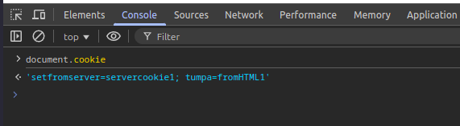
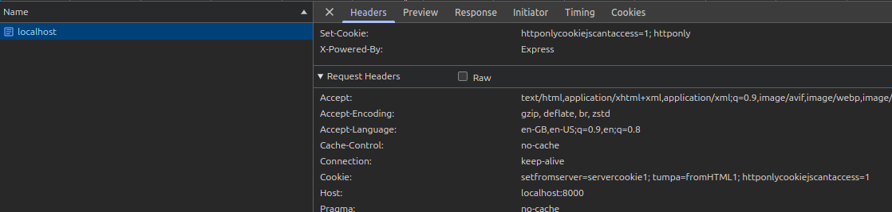

<h2> Creating Cookie </h2>

- Cookies can be set from server and browser
- server tells the browser to set the cookie


---
<h2> Cookie Properties </h2>

- Cookies are sent with every request, so it consumes more bandwidth when we have many cookies on website


<h3> Cookie Control </h3>

- so as many cookies can consume more bandwidth, so we can define cookie scope. 

  - Domain : Cookies are paired with domain. if i set cookie for one domain, the other domains/sub-domains(sub-domain too???) can't see the cookies. let, i set a cookie for example.com, i can't see the cookie in www.example.com.
   ``` document.cookie="tumpa=1" ```
  but no worries, we can set domain attribute with cookie to set which domain/sub-domains can access the cookie. for example if we want to give access to all sub-domains of example.com,
  ``` document.cookie="tumpa=1; domain=.example.com" ```

  - Path : sometimes we may need to set cookie for some specific path, for example in login page, we may need some login-time cookie, that we may not need for other pages/paths. so if we don't set path, every other paths(that doesn't need the cookie) will send the cookie in request and consume unnecessary bandwidth. so it is better to define path for specific cookies. 
  ```http
  document.cookie="cookiepath1=1; path=/path1"
  document.cookie="cookiepath2=1; path=/path2"  
  ```

<h2> expires and max age</h2>

- if we don't specify expires and max-age, the cookie will be deleted when the browser is closed. this type of cookie is called the session cookie.

---
<h2>SameSite attribute</h2>

now, what does this same site do? it has three different parameter: lax, strict, none

- if we set nothing, all the cookies are sent even if i am requesting from a different site


- strict: strict all sites other than the same site. let, we set a cookie at www.example.com
```http
document.cookie="secretcookie=1; samesite=strict"
```


only the secretcookie is set strict, other two cookies have no parameters. so other two cookies will be send with every request.



now, we can see the cookie only from the same site of www.example.com. but if we wanna visit www.example.com from a different site, it will not send the cookie which was set strict.

- lax:

---
<h2> Cookie Types </h2>

- session cookie: doesn't have max-age or expires, will be deleted when the beowser is closed
- permanent cookie: if we set max-age/expires, then the cookie will live until meets max-age/expires even if we close the browser.
- Httponly cookie: can only be set by the server, the browser can't read this. this is for security to prevent xss attack.
so now, we are gonna set a httponly cookie from the server

now, we can see a arrow in the httponly column

now, js(document.cookie) can't read the cookie

but we will still send the httponly cookie with every request we make. this is kinda we are sending the cookie, but js can't see this. this is useful when we want to pass a token.


- Secure cookie: only be sent in https protocols
- Third Party cookie: 
- Zombie cookie


---
<h2> Cookie Security </h2>

- Stealing Cookie
- Cross site Request Forgery

