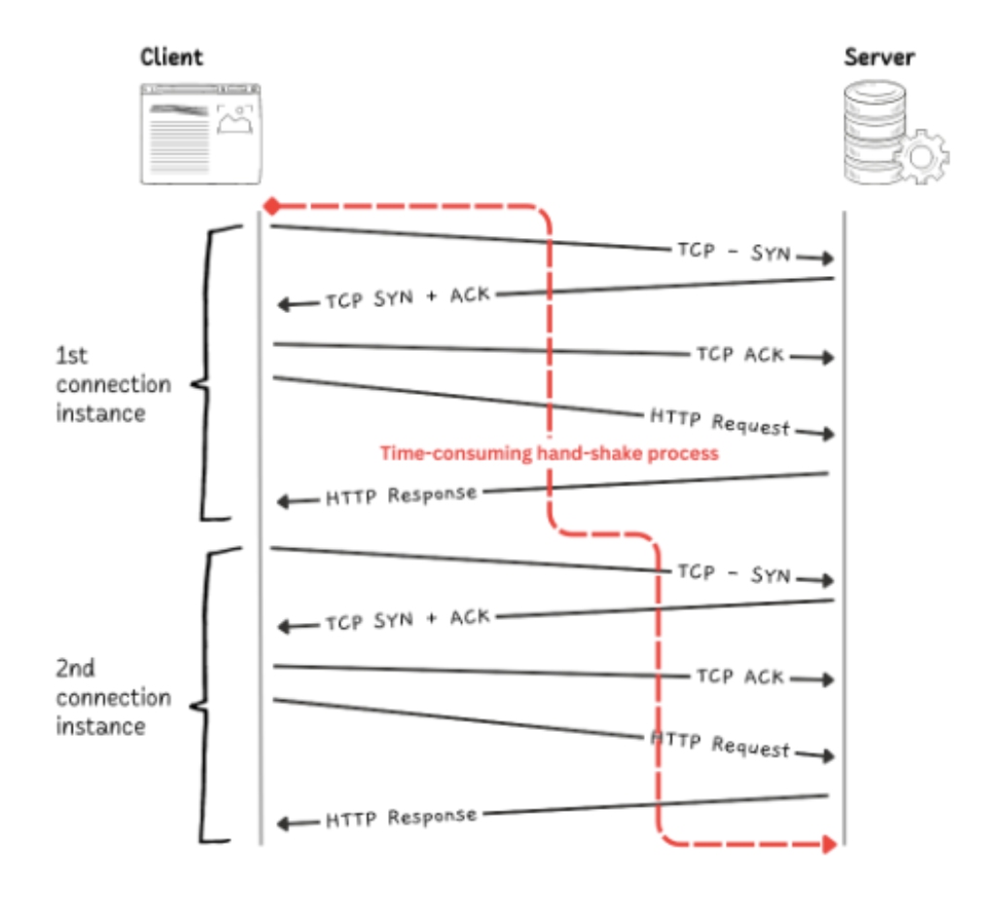
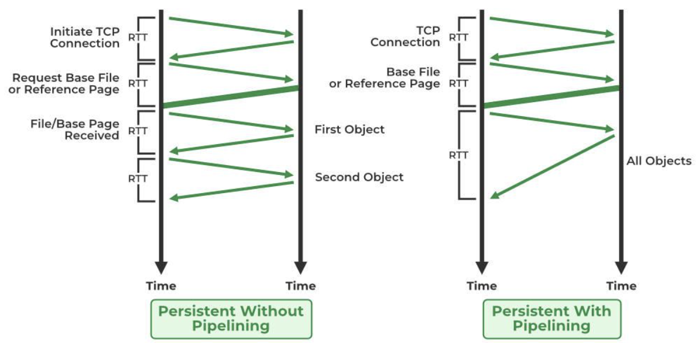

# 🌐 An Overview of HTTP

## Client-Server Protocol
- **Requests** are initiated by the **client** and received by the **server**.
- **Request**: Message sent by the client.
- **Response**: Message sent by the server as an answer to the request.

---

# Components of HTTP-based System

### HTTP is a Client-Server Protocol
- Between **client** and **server**, there are entities called **proxies** that act as both client and server.

### Types of Proxies:
- **Forward Proxy**: Forwards requests from and to anywhere on the internet. also called as tunnel or gateways


- **Reverse Proxy**: Takes requests from the internet and forwards them to the server through an internal network. (used to control and protect access to a server for load balancing, authetication, decryption or caching)


### Proxy Computers
- Proxy computers (modem, routers, etc.) that stand between the client and server are **hidden** to the **network** and **transport layer**.
- **HTTP** is at the **top**, in the **application layer**.

---

### 👤 Client
- **User Agent**: Always initiates the request.

### 🌍 The Web Server
- Serves the documents as requested by the client.
- The web server can appear as a single machine, but it may also be a collection of servers (e.g., load balancing, caching servers, database servers, e-commerce servers, etc.).
- The server partially or totally processes the request initiated by the client based on demand.

### 🔄 Proxies
- **Transparent Proxy**: Forwards the request without altering it on the way.
- **Non-transparent Proxy**: Alters the request before passing it to the server.
  
**Proxies can perform tasks like**:
- **Caching**
- **Filtering**
- **Logging**
- **Load Balancing**
- **Authentication**

---

# 📝 Basic Aspects of HTTP

### 1. HTTP is Simple
- Simple and human-readable.
- **HTTP/2** encapsulates HTTP messages into **frames**.

### 2. HTTP is Extensible
- Can introduce new header functionality.
- Need to learn more about **HEADERS**.

### 3. HTTP is Stateless, but Not Sessionless
- **Stateless**: Two requests don’t need to be forwarded to the same server; any server having the requested document can respond.
- **Stateful**: However, being stateless may create issues, such as when you want to interact with pages coherently (e.g., an e-commerce shopping basket).
  
  - The core of HTTP is stateless, but **HTTP cookies** allow the use of stateful sessions.
  - By using HTTP header extensibility, we can add the **session cookie** to the workflow. This allows session creation on the HTTP request to share the same context.

### 4. HTTP and Connections

#### Connection Control
- The connection is controlled by the **transport layer**.
- HTTP requires a **reliable transport protocol** to ensure no messages are lost.
  - **TCP** (reliable)
  - **UDP** (unreliable)

#### HTTP's Reliance on TCP
- HTTP relies on **TCP standards**, and it is **connection-based**.
- Before an HTTP exchange, the client and server need to establish a **TCP connection**, which requires several round trips.

#### HTTP Versions and Connection Efficiency:
- **HTTP/1.0**: Creates a new TCP connection for each request, which is less efficient.
- **HTTP/1.1**: Introduced **pipelining** and **persistent connections**.
- **HTTP/2**: Uses **multiplexed messages** over a single connection.


# HTTP Versions and Their Evolution

### **HTTP/1.0** 
- **Message Queue Type**: Requests are added in a queue.
- If one request closes, the other can proceed.



### **HTTP/1.1**
- **Pipelining**: Allows multiple requests to be sent in a single connection without waiting for each request to finish.
- However, a new problem may arise: **HOL (Head of Line) Blocking**.
  - **HOL Blocking** occurs when the number of parallel requests in the browser exceeds the limit. In this case, other requests need to wait for the former request to finish.

> Persistent Connection

#### 1. **Non-Pipelined Persistent Connection**
- In a **Non-pipelined connection**, the process is as follows:
  - First, we establish the connection, which takes **2 RTTs**.
  - Then, we send all the objects (such as images/text files), each of which takes **1 RTT**.
  - No **TCP connection** is required for each object(that is 3 way handshake)

#### 2. **Pipelined Persistent Connection**
- In a **Pipelined connection**, the process is as follows:
  - **2 RTTs** are required for connection establishment.
  - Then, only **1 RTT** (assuming no window limit) is needed for all the objects (i.e., images/text files) to be sent.



> so in short if we use pipeline, we need only TCP connection once then send all the object at a time. but without pipeline, we make TCP connection once, but we then send each object seperately.

### **HTTP/2.0**
- **Multiplexing**: Allows multiple requests and responses to be sent concurrently over a single connection, which eliminates HOL blocking at the **application layer**.
- However, **HOL blocking still exists** in the **Transport Layer** (TCP + TLS – Transport Layer Security).

### **HTTP/3**
- **UDP + QUIC** (didn’t go deep).


# Common Features Controllable with HTTP

### 1. **Caching**
- **Caching** allows HTTP to control how documents are stored and for how long.
- The **server** can instruct the client or proxy servers to cache data.
- The **client** can also tell proxies to ignore cached documents if necessary.

### 2. **Relaxing the Origin Constraint**
- By default, **web browsers** prevent websites from accessing information from other websites (for security reasons).
- However, there are times when it's useful for different websites to share information (e.g., a webpage displaying content from multiple domains).
- **HTTP headers** allow this strict rule to be relaxed, letting documents mix content from different websites.
  - **Note**: Relaxing this constraint can raise **security concerns**, so it should be done carefully.

### 3. **Authentication**
- Some pages are **protected**, allowing only specific users to access them.
- **Authentication** can be handled by HTTP using **WWW-Authenticate headers** or via **cookies** that track user sessions (e.g., login sessions).
- These methods ensure that only authorized users can access certain pages.

### 4. **Proxy and Tunneling**
- **Proxies** act as intermediaries between the client and the server. They are commonly used to:
  - Improve **performance** (e.g., caching).
  - Enforce **security** (e.g., filtering).
  - Hide the **user's IP address**.
- **Tunneling** refers to the ability to send data through a proxy, bypassing certain restrictions (such as firewalls).
  - It is commonly used with secure connections like **HTTPS**.

### 5. **Sessions**
- **HTTP** is a **stateless protocol**, meaning it doesn't remember past interactions.
- **Sessions** are used to maintain state across different requests. 
  - For example, when shopping on an e-commerce site, **cookies** store your shopping basket across multiple pages.
- **Cookies** are used to track and store session information, so the server can "remember" who you are and what you've done previously.

# HTTP Flow

When a client wants to communicate with a server (either the final server or an intermediate proxy), it performs the following steps:

### 1. Open a TCP Connection
- The **TCP connection** is used to send a request (or several requests) and receive an answer.
- The client may open a **new connection**, reuse an **existing connection**, or open **several TCP connections** to the servers.

### 2. Send an HTTP Message
- **HTTP messages** (before HTTP/2) are **human-readable**.
- In **HTTP/2**, these simple messages are encapsulated in **frames**, making them impossible to read directly, but the basic principle remains the same.
  
Example of an HTTP request:
```http
GET / HTTP/1.1
Host: developer.mozilla.org
Accept-Language: fr
```

### 3. Read the Response Sent by the Server
- The server sends a response back. An example of a response is as follows:
```http
HTTP/1.1 200 OK
Date: Sat, 09 Oct 2010 14:28:02 GMT
Server: Apache
Last-Modified: Tue, 01 Dec 2009 20:18:22 GMT
ETag: "51142bc1-7449-479b075b2891b"
Accept-Ranges: bytes
Content-Length: 29769
Content-Type: text/html

<!doctype html>...(here come the 29769 bytes of the requested web page)
```

### 4. Close or Reuse the Connection for Further Requests
- After the request and response, the connection can either be closed or reused for additional requests.

---

### **HTTP Pipelining**
- If **HTTP pipelining** is activated, several requests can be sent without waiting for the first response to be fully received.
- However, HTTP pipelining has proven difficult to implement in older networks, where old software versions coexist with newer ones.
