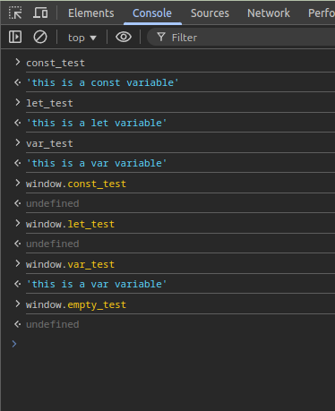
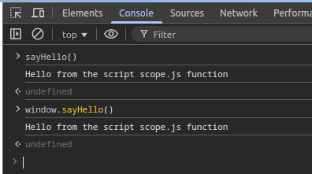

## short notes when reading and coding

- the variable declared *outside of any: function, block, module, if/else/switch statements* is called global variable
- global variables can be used from any other js that is running on the same page like a *script tag* or via the *console log*
- In the browser, the global scope is called window

## const-let-var window and global scope check

- in the picture above, the var variables are attached to the window object
- also we can see const_test and let_test are not defined in the window scope but they are still in global scoped just not attached to the window.

## function window and global scope check

- in the above picture, the sayHello() function is both available globally and window object, because anything that is in the global scope is attached to the window object with the exception of const and let variables.

****?? The question is, why everytime the function is called, it logged the result, then why print undefined??****

